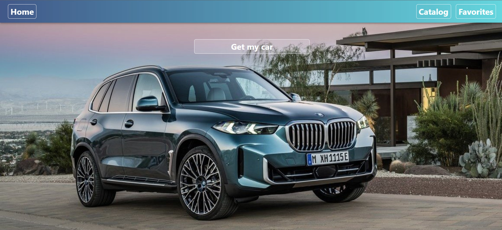

# Rental_car

Rental_car - web application, was created for a company that provides car
rental services in Ukraine.

## Tectologies:

- built with React;
- HTML5;
- Css3;
- JavaScript;
- React Redux
- Redux Toolkit
- Axios;
- styled-components;
- React Router;
- Mockapi.io (backend)

## Start development:

Start development mode by running the "npm start" command.
